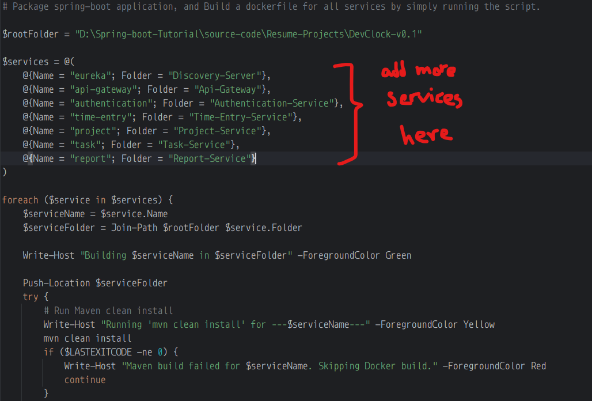
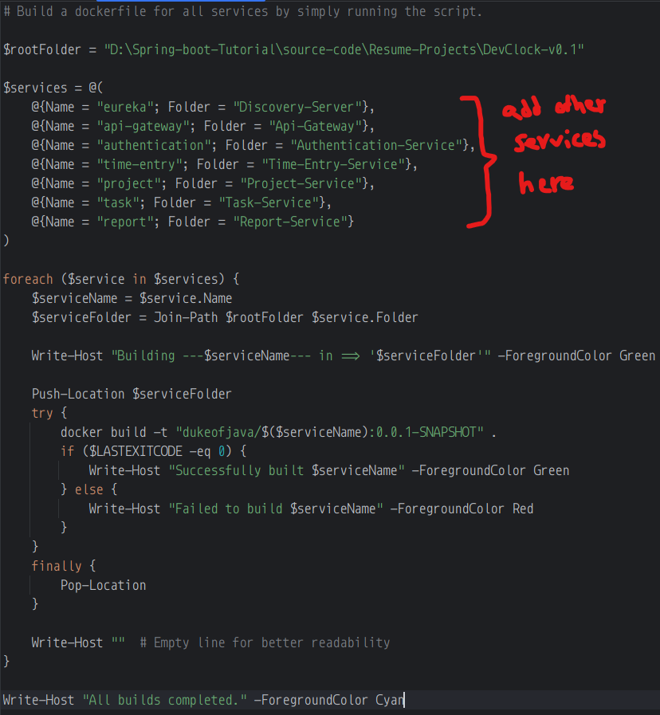

# Powershell Scripts

There are two main scripts present in this directory:

1. [package_and_build_dockerimages](package_and_build_dockerimages.ps1)

   It builds the spring boot application (i.e., `mvn clean install`) for all the services by searching the name provided
   from the root folder,
   and then builds the docker image (i.e., `(i.e., `docker build -t "dukeofjava/SERVICE_NAME:0.0.1-SNAPSHOT"`)`:
   

    
   
2. [build_dockerimages](build_dockerimages.ps1)

   Assuming there is a `jar` file present for all the services; this script builds a docker image (
   i.e., `docker build -t "dukeofjava/SERVICE_NAME:0.0.1-SNAPSHOT"`) for the services
   by searching the root folder:
   

> Note:
>
> This script will work if and only if: the services are in the root folder, and also provided with the same name in the
> respective script.

